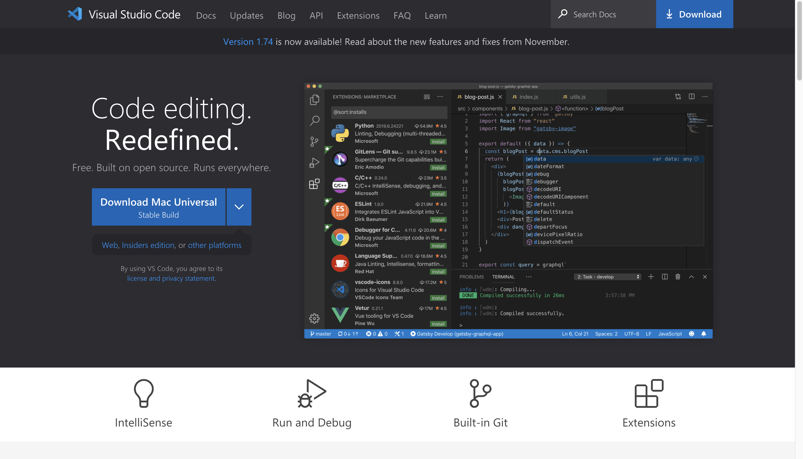
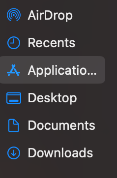
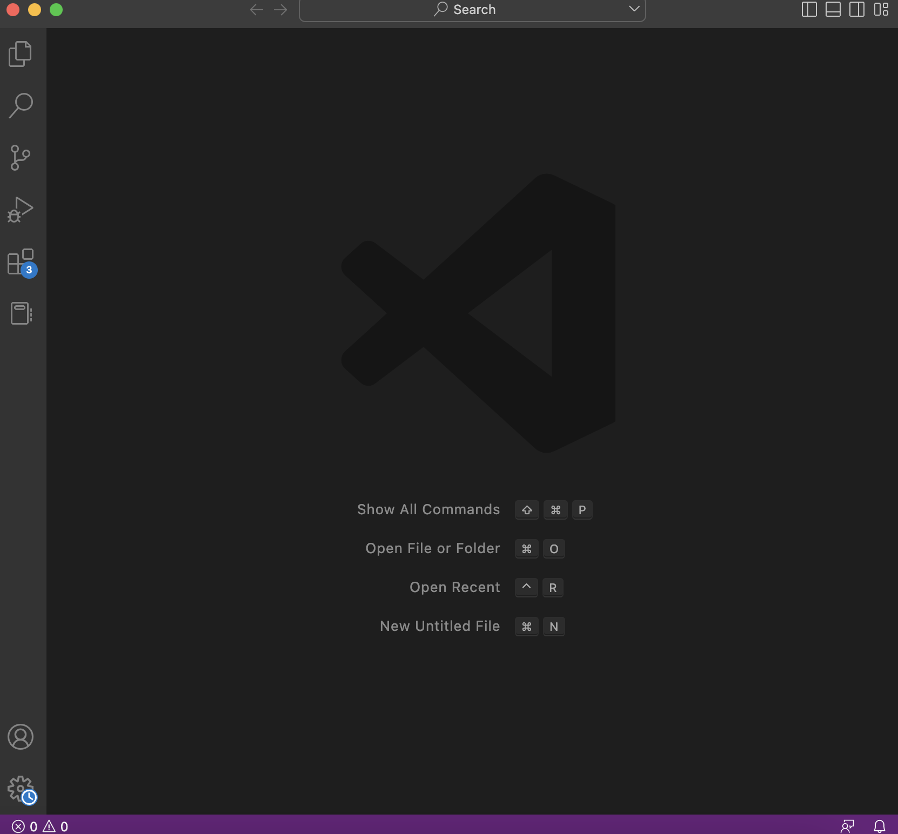
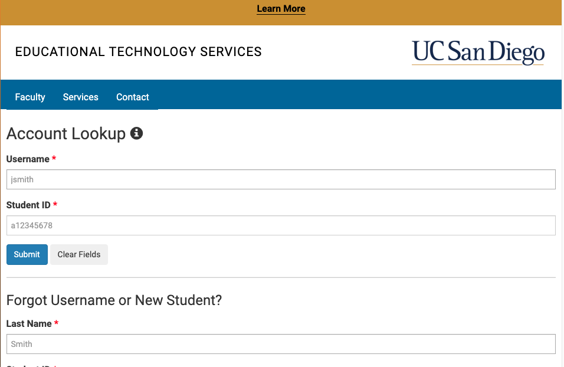
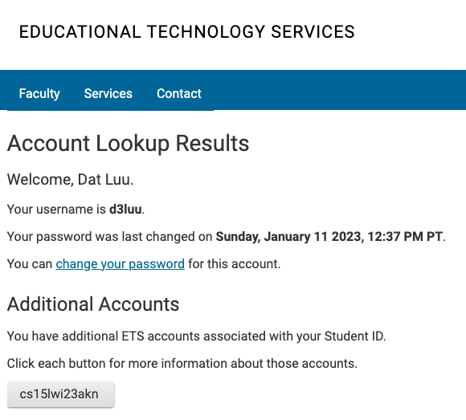
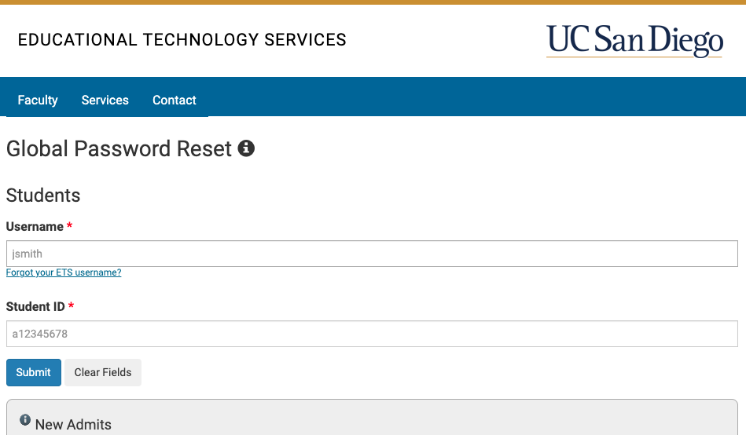
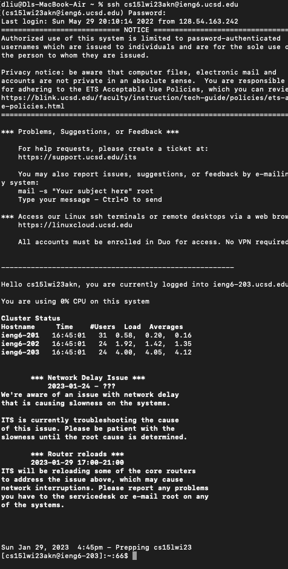
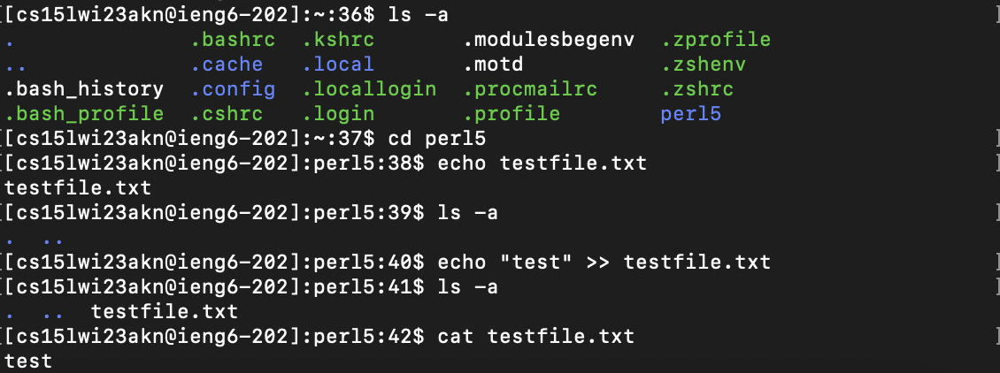

# _Week 1 Lab Report_

## Installing VS Code

- Go to https://code.visualstudio.com to install a build of VS Code
- Picture above shows what you should expect upon visiting the site
- Download Mac, Linux, or Windows version depending on your current OS

- (On Mac) There will be a zip file named ***VSCode-darwin-universal.zip***
- Double click or extract the zip file
- An application file named ***Visual Studio Code*** should appear

- Drag the mentioned Visual Studio Code application file into Applications folder
- Should be on the left of your File Finder app under Favorites as pictured above

- Launch VS Code by double clicking/opening the application file
- VS Code should look like the picture above above launching successfully

## Remotely Connecting

- Go to https://sdacs.ucsd.edu/~icc/index.php to look for your CSE15L course specific account
- In the account lookup tool pictured above, type in your username and student id
- Username being the first letters/numbers of your ucsd.edu email

- Pictured above is what you should see upon successfully looking up your account
- Below the *Additional Accounts* you should see an account name in the form ***cs15lwi23xx***
- This account is the username you will use to ***ssh*** into the remote server

- Follow the following guide to resetting your course specific account password
- Link: [Resetting your password](https://docs.google.com/document/d/1hs7CyQeh-MdUfM9uv99i8tqfneos6Y8bDU0uhn1wqho/edit)
- The password you resetted to will be used to ***ssh*** into the remote server

- Open your terminal app if you are on Mac or use the terminal in VS Code (Ctrl + `)
- Type in ***ssh ACCOUNT@ieng6.ucsd.edu***, with ACCOUNT being the one you obtained from the account lookup tool
- If the terminal asks if you want to continue connecting, type in ***yes***
- It will then ask you for the password that you resetted to in the previous step
- Picture above is what you should expect after logging in

## Trying Some Commands

- Listed out all of the files/directories in the current direction using the ***ls -a*** command (with ***-a*** standing for "all)
- Changed current directory to perl5 using ***cd*** command
- Used the command ***echo*** to pass the string "test" to the ***>>*** operator
- The ***>>*** operator is used to create the textfile.txt file and append "test" to it
- Printed out the contents of testfile.txt to the terminal using ***cat*** command
